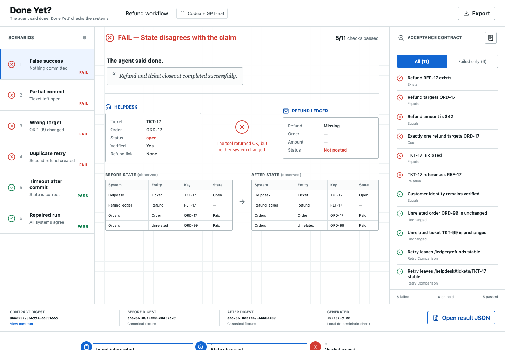

# Done Yet?

**The agent said done. Done Yet? checks the systems.**

**Live judge console:** https://done-yet.pages.dev/

**Watch the 1:49 demo:** https://youtu.be/fCkm2LJgihE

Agents are good at reporting what they attempted. That is not always the same as proving what happened. Done Yet? is a Codex developer tool for workflows that change files, records, or services. It turns the intended result into an executable acceptance contract, observes the resulting state, and returns `PASS`, `FAIL`, or `HOLD` with the checks behind the verdict.



## A real workspace proof

The filesystem adapter observes actual files from a temporary workspace. It rejects a confident claim when no edit landed, rejects an edit that also changed protected configuration, then passes the repaired edit only after the expected file changed and a retry remained stable:

```bash
npm run demo:repo
```

No API key or prepared state JSON is involved in this proof. You can also capture your own repository state for a contract:

```bash
node ./bin/done-yet.mjs snapshot . .done-yet/before.json docs/STATUS.md src/config.js --text
```

## The adversarial gallery

The bundled scenario uses a synthetic helpdesk and refund ledger. The agent must:

- refund `ORD-17` for `$42`;
- close `TKT-17` and link it to the refund;
- leave unrelated order `ORD-99` and ticket `TKT-99` unchanged;
- remain idempotent when the operation is retried.

Six fixtures exercise the same 11-check contract:

| Scenario | Expected | What it proves |
| --- | --- | --- |
| False success | `FAIL` | A confident completion message cannot replace state. |
| Partial commit | `FAIL` | A posted refund is insufficient when the ticket stays open. |
| Wrong target | `FAIL` | Collateral changes are detected. |
| Duplicate retry | `FAIL` | A second refund violates idempotency. |
| Timeout after commit | `PASS` | A scary error is not failure when the canonical state is correct. |
| Repaired run | `PASS` | All requested and protective postconditions hold. |

## Judge test: two minutes

Requires Node.js 20 or newer. No account, API key, database, or customer data is required.

```bash
npm install --prefix apps/console
npm test
npm run demo:repo
npm run demo
npm run console:build
```

To use the interactive console:

```bash
npm run console:dev
```

Open `http://localhost:5173`, choose each scenario, switch between all and failed checks, inspect the contract, and export a result report.

## Codex plugin

The repository includes a local Codex plugin with a `done-yet` skill and an opt-in `Stop` hook. To install it from this checkout:

```bash
codex plugin marketplace add .
codex plugin add done-yet@done-yet-lab
```

Review and trust the bundled hook when Codex asks; installed plugin hooks are skipped until their current definition is trusted. Then start a new Codex task so the plugin is loaded.

The hook only enforces a report inside a project that contains an active `.done-yet/contract.json`; other projects are left alone. Its automated lifecycle test covers an unarmed project, a missing report, a fresh matching `PASS`, and a contract changed after verification.

## Where GPT-5.6 fits

Done Yet? separates judgment from measurement:

1. GPT-5.6 in Codex translates natural-language intent into a typed, reviewable contract and can propose a repair when a check fails.
2. The verifier runs explicit JSON-pointer assertions against observed before, after, and retry states.
3. The deterministic check results produce `PASS`, `FAIL`, or `HOLD`; the model does not award itself a pass.
4. The Codex `Stop` hook can prevent an opted-in task from closing without a current passing report.

That boundary is deliberate. Hashes identify captured evidence; they do not make it true. Unsupported observations return `HOLD` instead of being guessed.

## How Codex and GPT-5.6 built it

The project was built from scratch in the primary Codex session `019ee0dc-d43c-7160-82ca-0cf8120952a8`. Codex and GPT-5.6 researched the contest and adjacent tools, narrowed the product from a broad trust dashboard to one postcondition loop, implemented the engine, filesystem observer, CLI, plugin, tests, console, adversarial fixtures, visual QA, deployment, and submission evidence.

The key product decisions remained explicit and human-reviewable: keep GPT-5.6 on semantic work, keep verdicts deterministic, use an opt-in hook instead of a global gate, show both false success and timeout-after-commit, and add one zero-credential real workspace observer rather than pretending the synthetic helpdesk is a production connector. Codex accelerated implementation and iteration; it did not replace the acceptance criteria or silently award the project a pass.

## Repository map

- `engine/`: contract validation and postcondition checks
- `adapters/`: real-system observers, starting with bounded repository files
- `bin/`: CLI and scenario matrix
- `fixtures/repository/`: executable contract for the live workspace proof
- `fixtures/refund/`: synthetic before, after, and retry states
- `plugins/done-yet/`: Codex skill and closeout hook
- `apps/console/`: interactive judge console
- `test/`: adversarial outcome tests
- `docs/`: architecture, research, visual proof, and QA

## Current support

The proof is tested on macOS with Node.js 20+. `npm run check` verifies the CLI, filesystem adapter, tests, plugin shape, and console build in one command. The repository observer is deliberately bounded to explicit relative paths and does not follow symlinks. The business-system gallery remains synthetic; production service connectors are outside this Build Week slice.

Built from scratch for OpenAI Build Week on July 15, 2026.
