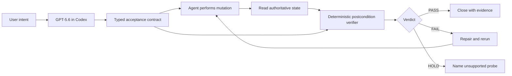

# Architecture

Done Yet? places a narrow verification loop after an agent changes external state.

## Responsibility boundary

| Layer | Responsibility | Does not do |
| --- | --- | --- |
| GPT-5.6 + Codex | Translate intent into typed checks; explain failures; propose repairs. | Decide that an unobserved outcome succeeded. |
| State adapter | Read the relevant before, after, and retry state from a system. | Reuse the agent's completion message as evidence. |
| Verifier | Run `exists`, `equals`, `count`, `relation`, `unchanged`, and retry-stability checks. | Make semantic guesses or call an LLM. |
| Outcome report | Preserve verdict, individual checks, evidence digests, and generation time. | Claim hashes prove authenticity or truth. |
| Codex Stop hook | Require a current passing report in a project that opted in with a contract. | Affect projects without a `.done-yet/contract.json`. |

## Proof data flow

The zero-credential repository proof uses `adapters/filesystem.mjs` to read explicitly named relative paths from a live temporary workspace. It records file existence, type, byte count, digest, and optional UTF-8 text without following symlinks. `npm run demo:repo` proves both a false completion claim and a repaired, retry-stable edit against those observations.

The adversarial business-system gallery remains local JSON so every judge sees the same evidence. `scripts/build-console-data.mjs` invokes the same verifier used by the CLI and emits `apps/console/public/data/demo.json`; the React console does not carry a second verdict implementation.

`HOLD` has a precise meaning: a required contract or observation is unavailable. A failed assertion is `FAIL`, including wrong-target changes and non-idempotent retries.

## Threats this slice exercises

- false success: no requested state was committed;
- partial commit: one system changed while a related system did not;
- wrong target: the requested object was untouched or collateral state changed;
- duplicate retry: an uncertain operation was repeated unsafely;
- timeout ambiguity: the transport failed after the canonical commit succeeded.

The current proof does not claim production service connectors, cryptographic attestation, or universal agent evaluation. It demonstrates a small postcondition engine, one real repository observer, a tested Codex closeout hook, and a judge-readable evidence surface.
